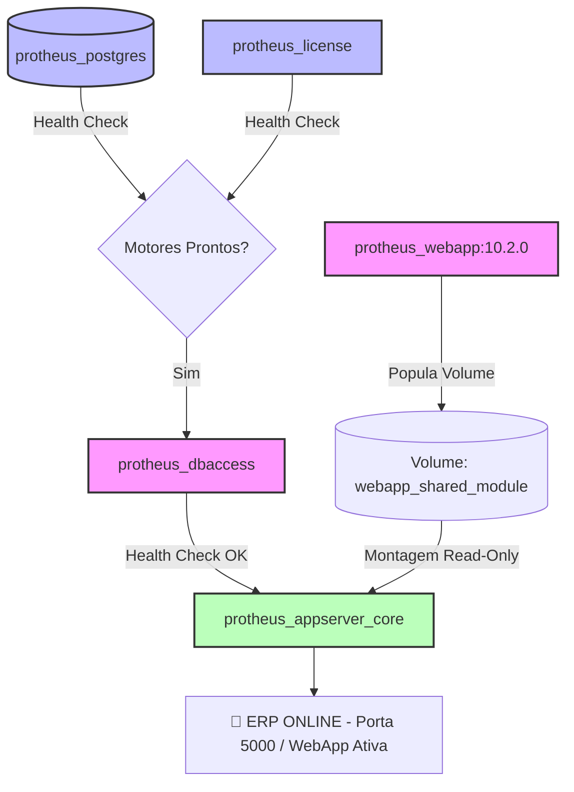

# 🎛️ TOTVS Protheus - Microservices DevOps Stack Orchestrator

Este repositório é um componente isolado da arquitetura TOTVS Protheus Modern DevOps [https://github.com/rodrigomicrosiga-devops/totvs-protheus-modern-devops], e centraliza a orquestração global do ecossistema distribuído do ERP TOTVS Protheus na organização **`rodrigomicrosiga-devops`**. Ele consome as imagens imutáveis geradas pelas fábricas de CI/CD do Docker Hub e consolida a conectividade de rede, persistência volumétrica e gerência de ciclo de vida de todo o barramento do ERP com um único comando.

---

## 🏗️ Topologia de Redes e Dependências de Subida

A stack gerencia as dependências internas do ecossistema através de sondas de saúde (*healthchecks*), garantindo que as camadas de persistência e validação estejam prontas antes do acoplamento dos tradutores e servidores de aplicação.



### 🚀 Como Executar a Stack Completa

Para levantar o ecossistema completo amarrando a gerência dinâmica de variáveis, execute o comando apontando o arquivo de ambiente:

```bash
# Inicialização global da infraestrutura distribuída do Protheus
docker compose --env-file .env.protheus --profile postgres up -d
```


